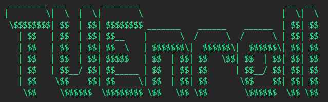
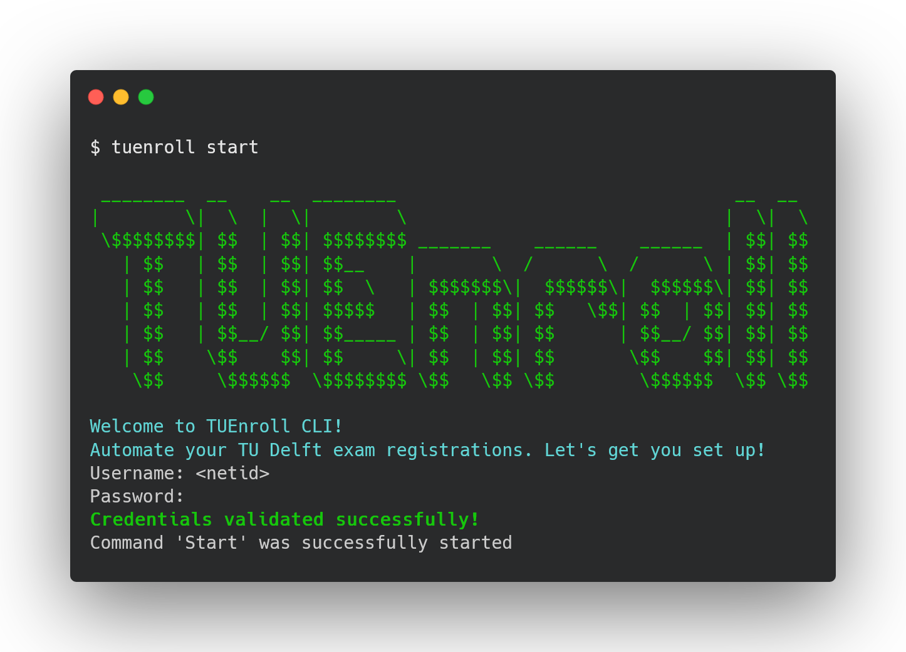

# TUEnroll

A CLI tool that automatically registers you for TU Delft exams. It:
- Registers for all exams in your enrolled courses
- Stores credentials securely on your computer
- Sends notifications when registration is successful

<p align="center">
  
</p>

<p align="center">
  <a href="https://github.com/dhruvan2006/tuenroll/actions">
    
  </a>
  <a href="https://codecov.io/gh/dhruvan2006/tuenroll"> 
     
  </a>
  <a href="https://opensource.org/licenses/MIT">
    
  </a>
  <a href="https://github.com/dhruvan2006/tuenroll/releases">
    
  </a>
</p>

# 💻 Installation

## ⚡ Quick Install (Recommended)

### 🪟 Windows

```bash
powershell -c "irm https://raw.githubusercontent.com/dhruvan2006/tuenroll/main/install.ps1 | iex"
```

### 🐧 Linux
#### Ubuntu/Debian:
```bash
sudo apt install libdbus-1-dev pkg-config
curl -fsSL https://raw.githubusercontent.com/dhruvan2006/tuenroll/main/install.sh | sh
```

#### Fedora:
```bash
sudo dnf install dbus-devel pkgconf-pkg-config
curl -fsSL https://raw.githubusercontent.com/dhruvan2006/tuenroll/main/install.sh | sh
```

### 🍎 macOS
🚧 macOS support is under development

## 🛠️ Alternative methods

### 📦 Using Cargo
If you have Rust installed:
```bash
cargo install tuenroll
```


### 🔧 From Source

```bash
git clone https://github.com/dhruvan2006/tuenroll.git
cd tuenroll
cargo install --path .
```

## ♻️ Usage

### 🚀 Start background service:
It sets up periodic checks to register for exams.
```bash
tuenroll start
```

<p align="center">
  
</p>

### 🔨 Other commands:
1. Run a one time check:

```bash
tuenroll run
```

2. Stop Background Service:

```bash
tuenroll stop
```

3. Change credentials:

```bash
tuenroll change
```

4. Delete Credentials:

```bash
tuenroll delete
```

5. View Status:

```bash
tuenroll status
```

6. View Logs:

```bash
tuenroll log
```

## Disclaimer

This tool is not officially affiliated with TU Delft. Use it responsibly and at your own risk.
